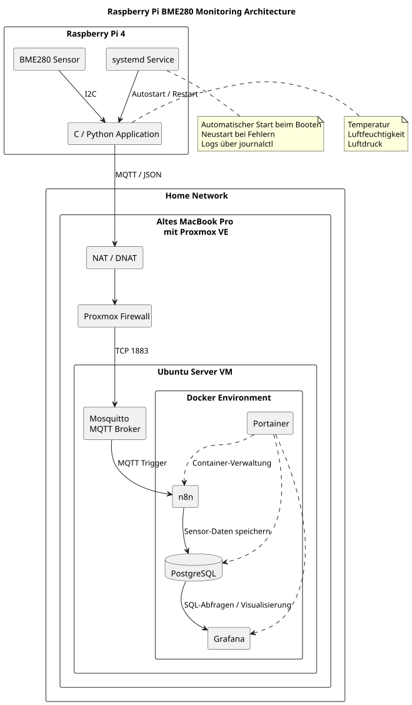
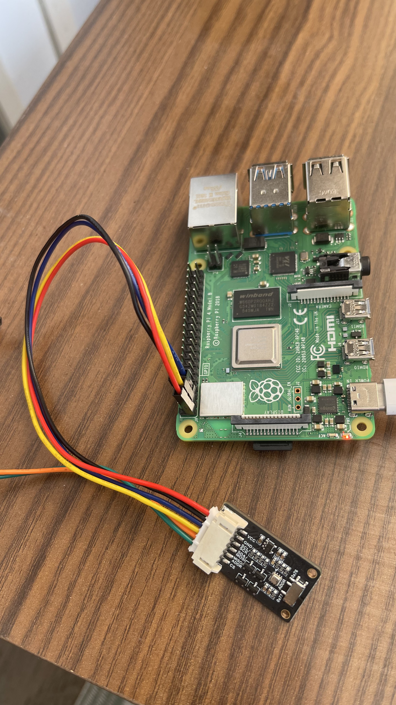
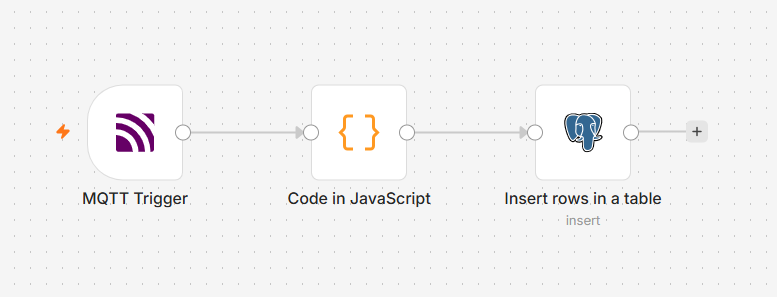
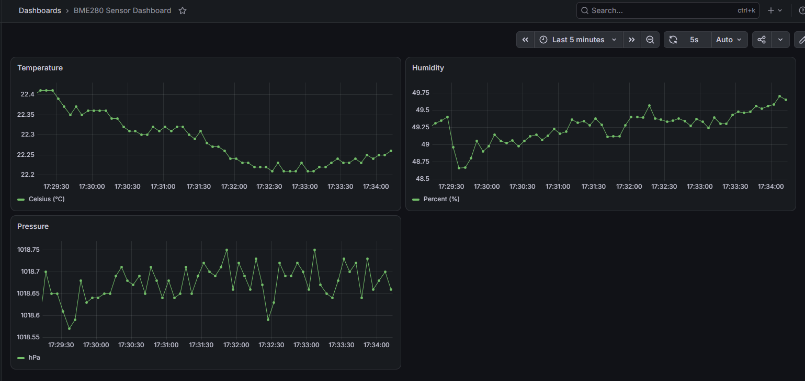
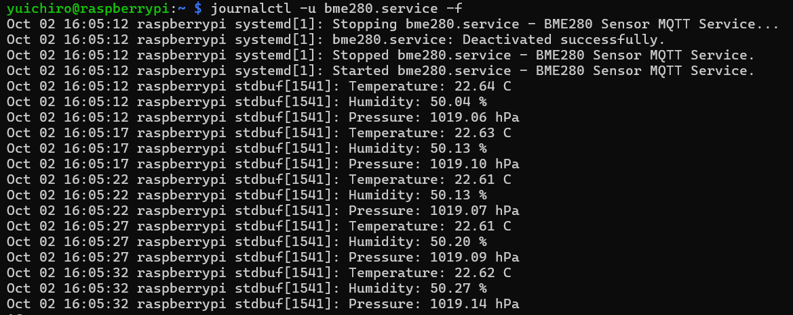

# Raspberry Pi BME280 Monitoring mit MQTT, PostgreSQL und Grafana

Dieses Projekt ist ein kleines Embedded-Linux- und IoT-Homelab auf Basis eines Raspberry Pi 4 und eines BME280-Sensors.

Ziel des Projekts ist es, Sensordaten mit C und Python auszulesen, über MQTT an einen Linux-Server zu übertragen, in PostgreSQL zu speichern und anschließend mit Grafana zu visualisieren.

Zusätzlich werden die Bereitstellung von Proxmox-VMs mit Terraform, die Serverkonfiguration mit Ansible und die Freigabe geprüfter Codeänderungen über eine CI/CD-Pipeline mit GitHub Actions automatisiert.

## Architektur

```text
BME280 Sensor
    ↓ I2C
Raspberry Pi 4
    ↓
C / Python
    ↓ JSON
MQTT Publish
    ↓
Proxmox Host
192.168.xxx.xxx
    ↓ DNAT Port 1883
Ubuntu Server VM
10.10.xxx.xxx
    ↓
Mosquitto
    ↓
n8n
    ↓
PostgreSQL
    ↓
Grafana
```


## Raspberry Pi

Auf dem Raspberry Pi wird der BME280 über I2C angesprochen.

Der Sensor liefert:

- Temperatur
- Luftfeuchtigkeit
- Luftdruck

Die I2C-Adresse des verwendeten Sensors ist:

```text
0x77
```

<p align="center">
  
</p>

### C-Version

Die erste Version wurde in C umgesetzt.

Dabei wurden unter anderem folgende Themen praktisch verwendet:

- Linux I2C Device Interface
- `/dev/i2c-1`
- `open()`, `read()`, `write()` und `ioctl()`
- BME280 Register
- Bitoperationen
- Rohdatenverarbeitung
- Kalibrierungswerte des Sensors
- Pointer
- Structs
- Aufteilung des Programms in Funktionen
- MQTT mit `libmosquitto`

Die Messwerte werden in einer Struktur gespeichert:

```c
struct SensorData {
    double temperature;
    double humidity;
    double pressure;
};
```

Das Programm liest die Daten regelmäßig aus und veröffentlicht sie als JSON über MQTT.

Beispiel:

```json
{
  "temperature": 22.69,
  "humidity": 26.83,
  "pressure": 1010.68
}
```

### Python-Version

Zusätzlich wurde eine Python-Version erstellt, um die Unterschiede zwischen einer Low-Level-Implementierung in C und einer Umsetzung mit bestehenden Python-Bibliotheken zu vergleichen.

Verwendete Bibliotheken:

```text
smbus2
RPi.bme280
paho-mqtt
```

Die Python-Version verwendet Bibliotheken für die BME280-Kalibrierung und die I2C-Kommunikation, während diese Schritte in der C-Version wesentlich direkter umgesetzt werden.

## MQTT

Als MQTT Broker wird Mosquitto auf der Ubuntu-Server-VM verwendet.

MQTT-Port:

```text
1883
```

Verwendetes Topic:

```text
home/sensor/bme280
```

Für Tests wurden außerdem getrennte Topics verwendet, zum Beispiel:

```text
home/sensor/bme280/c
home/sensor/bme280/python
```

Dadurch können die C- und Python-Version miteinander verglichen werden.

## Proxmox Netzwerk

Die Ubuntu-VM befindet sich in einem internen Proxmox-Netzwerk:

```text
10.10.xxx.0/24
```

Ubuntu Server:

```text
10.10.xxx.xxx
```

Der Proxmox-Host ist über WLAN mit dem Heimnetz verbunden:

```text
192.168.xxx.xxx
```

Für den Zugriff auf interne Dienste werden DNAT-Regeln mit nftables verwendet.

Beispiele:

```text
192.168.xxx.xxx:2222 → 10.10.xxx.xxx:22
192.168.xxx.xxx:5678 → 10.10.xxx.xxx:5678
192.168.xxx.xxx:9443 → 10.10.xxx.xxx:9443
192.168.xxx.xxx:1883 → 10.10.xxx.xxx:1883
192.168.xxx.xxx:3000 → 10.10.xxx.xxx:3000
```

Zusätzlich wird NAT/Masquerading verwendet, damit die VM über den Proxmox-Host auf das Internet zugreifen kann.

Da die Proxmox Firewall aktiv ist, wurde für das NAT außerdem eine Conntrack-Zone konfiguriert.

```bash
iptables -t raw -I PREROUTING -i fwbr+ -j CT --zone 1
```

Die Netzwerkkonfiguration wird über ein eigenes Skript automatisiert:

```text
/usr/local/sbin/homelab-nat.sh
```

Dieses Skript wird über einen systemd-Service beim Start des Proxmox-Hosts ausgeführt.

## Mosquitto

Mosquitto läuft direkt auf der Ubuntu-Server-VM.

Der Broker lauscht auf:

```text
0.0.0.0:1883
```

Für die aktuelle Homelab-Umgebung werden anonyme MQTT-Verbindungen verwendet.

Beispiel für einen manuellen Test:

```bash
mosquitto_pub \
  -h 192.168.xxx.xxx \
  -p 1883 \
  -t home/sensor/test \
  -m "MQTT test"
```

Empfang auf dem Ubuntu Server:

```bash
mosquitto_sub \
  -h localhost \
  -t 'home/sensor/#' \
  -v
```

## n8n

n8n läuft als Docker-Container auf der Ubuntu-Server-VM.

Workflow:

```text
MQTT Trigger
    ↓
Code
    ↓
PostgreSQL Insert
```

Der MQTT Trigger empfängt die JSON-Daten des Raspberry Pi.

Anschließend werden die Werte verarbeitet:

```text
temperature
humidity
pressure
```

und in PostgreSQL gespeichert.



## PostgreSQL

PostgreSQL läuft als Docker-Container.

Verwendete Version:

```text
PostgreSQL 16
```

Die Messwerte werden in der Tabelle `sensor_data` gespeichert.

```sql
CREATE TABLE sensor_data (
    id SERIAL PRIMARY KEY,
    temperature DOUBLE PRECISION,
    humidity DOUBLE PRECISION,
    pressure DOUBLE PRECISION,
    created_at TIMESTAMP DEFAULT CURRENT_TIMESTAMP
);
```

Beispiel:

```text
 id | temperature | humidity | pressure | created_at
----+-------------+----------+----------+---------------------
  1 |       22.69 |    26.83 |  1010.68 | ...
```

## Grafana

Grafana läuft ebenfalls als Docker-Container.

Grafana greift direkt auf PostgreSQL zu und stellt die gespeicherten Messwerte dar.

Das Dashboard enthält getrennte Panels für:

- Temperatur in °C
- Luftfeuchtigkeit in %
- Luftdruck in hPa

Dadurch können die Messwerte über die Zeit beobachtet werden.



## systemd Service

Die C-Anwendung wird auf dem Raspberry Pi als systemd-Service betrieben.

Dadurch startet die Anwendung automatisch beim Booten des Raspberry Pi und wird bei einem Fehler automatisch neu gestartet.

Status:

```bash
systemctl status bme280.service

journalctl -u bme280.service -f
```


## Docker / Portainer

Auf dem Ubuntu Server werden mehrere Dienste mit Docker betrieben und über Portainer verwaltet:

```text
n8n
PostgreSQL
Grafana
Portainer
```

## Terraform: Infrastruktur als Code

Die Konfiguration in [terraform/proxmox](terraform/proxmox) verwendet den Provider `bpg/proxmox`, um zwei virtuelle Maschinen auf dem Proxmox-Knoten `pve` als vollständige Klone des Templates mit der VM-ID `9000` bereitzustellen:

| VM | VM-ID | CPU-Kerne | RAM | Festplatte |
| --- | --- | --- | --- | --- |
| `lab-vm01` | 101 | 2 | 2048 MB | 20 GB |
| `ansible01` | 102 | 1 | 1024 MB | 20 GB |

Die Konfiguration legt außerdem den Speicher `local-lvm`, die Netzwerk-Bridge `vmbr0` sowie statische IPv4-Adressen und ein Gateway fest. Über Cloud-Init werden der Benutzer `yuichiro` und ein SSH-Public-Key eingerichtet.

Voraussetzungen sind eine lokale Terraform-Installation, Zugriff auf die Proxmox-API und ein vorhandenes, für Cloud-Init vorbereitetes Template. Vor der ersten Ausführung wird `terraform/proxmox/terraform.tfvars` anhand von [terraform.tfvars.example](terraform/proxmox/terraform.tfvars.example) angelegt und mit `proxmox_api_token` und `ssh_public_key` befüllt. Die Angaben in `main.tf`, insbesondere API-Endpunkt, VM-IDs, Netzwerk und Benutzername, werden an die eigene Umgebung angepasst.

Ausführung aus dem Repository-Hauptverzeichnis:

```bash
terraform -chdir=terraform/proxmox init
terraform -chdir=terraform/proxmox plan
terraform -chdir=terraform/proxmox apply
```

Die lokale Datei `terraform.tfvars`, Terraform-State-Dateien und das Verzeichnis `.terraform/` sind über `.gitignore` ausgeschlossen.

## Ansible: Serverkonfiguration

Das Playbook [ansible/playbook.yml](ansible/playbook.yml) konfiguriert die Hosts der Inventory-Gruppe `lab` über SSH und führt administrative Aufgaben mit `become: true` aus.

Automatisierte Schritte:

- APT-Paketindex aktualisieren.
- Basispakete installieren: `curl`, `git`, `vim`, `htop` und `ca-certificates`.
- Zeitzone auf `Europe/Berlin` setzen.
- Docker über das Paket `docker.io` installieren und den Dienst starten sowie beim Booten aktivieren.
- Den Benutzer `yuichiro` zur Gruppe `docker` hinzufügen.

Auf dem Steuerrechner werden Ansible und die Collection `community.general` für das Zeitzonen-Modul benötigt. Die Ziel-VM muss über SSH erreichbar sein und dem verwendeten Benutzer die benötigten sudo-Rechte gewähren.

Vor der Ausführung wird `ansible/inventory.ini` anhand von [inventory.ini.example](ansible/inventory.ini.example) angelegt und mit der Zieladresse und dem SSH-Benutzer befüllt. Der Benutzername im Playbook muss ebenfalls zur eigenen Umgebung passen. Die lokale Inventory-Datei ist über `.gitignore` ausgeschlossen.

Ausführung aus dem Repository-Hauptverzeichnis:

```bash
ansible-galaxy collection install community.general
ansible-playbook -i ansible/inventory.ini ansible/playbook.yml
```

Damit steht eine automatisierte Grundkonfiguration der Lab-VM einschließlich Docker zur Verfügung.

## CI/CD mit GitHub Actions

Der Workflow [Sensor CI](.github/workflows/ci.yml) startet bei jedem Push auf den Branch `main` und läuft auf einem Ubuntu-Runner.

Die Pipeline führt folgende Schritte aus:

1. Repository auschecken und die C-Abhängigkeit `libmosquitto-dev` installieren.
2. `c/bme280_test.c` mit `gcc -Wall -Wextra` kompilieren und gegen `libmosquitto` linken.
3. Die Python-Syntax mit `python3 -m py_compile python/bme280_test.py` prüfen.
4. Nach erfolgreichen Prüfungen den Branch `deploy` per Force-Push auf den geprüften Commit setzen.

```text
Push auf main
    ↓
C-Build
    ↓
Python-Syntaxprüfung
    ↓ nur bei Erfolg
Branch deploy aktualisieren
```

Der im Repository definierte CD-Schritt besteht in der Freigabe des geprüften Codes über den Branch `deploy`. Dafür besitzt der Workflow die Berechtigung `contents: write`. Die Prüfungen decken die Kompilierung und Python-Syntax ab. Für eine Funktionsprüfung mit dem BME280 ist zusätzlich ein Test auf dem Raspberry Pi erforderlich.

Terraform und Ansible werden mit den oben gezeigten Befehlen unabhängig von diesem Workflow ausgeführt.

## Aktueller Datenfluss

```text
BME280
↓
Raspberry Pi
↓
C oder Python
↓
JSON
↓
MQTT
↓
Proxmox NAT / Firewall
↓
Ubuntu Server
↓
Mosquitto
↓
n8n
↓
PostgreSQL
↓
Grafana
```

## Lernziele

Mit dem Projekt werden verschiedene Bereiche miteinander verbunden:

- C
- Python
- Embedded Linux
- Raspberry Pi
- I2C
- Sensorik
- MQTT
- Linux Networking
- NAT
- nftables
- Proxmox
- Terraform / Infrastructure as Code
- Ansible / Konfigurationsmanagement
- CI/CD mit GitHub Actions
- Docker
- Portainer
- n8n
- PostgreSQL
- Grafana
- systemd
- Troubleshooting

Besonders wichtig ist dabei nicht nur die reine Sensorabfrage, sondern der komplette Datenfluss vom Embedded-Gerät bis zur Speicherung und Visualisierung auf einem Server.

## Nächste Schritte

Geplante Erweiterungen:

- Fehler- und Ausfallerkennung
- Monitoring für MQTT und Sensorverfügbarkeit
- Benachrichtigungen bei Fehlern
- Firewall-Regeln weiter einschränken
- VPN / Site-to-Site-VPN testen
- weitere Sensoren hinzufügen
- Vergleich der C- und Python-Implementierung
